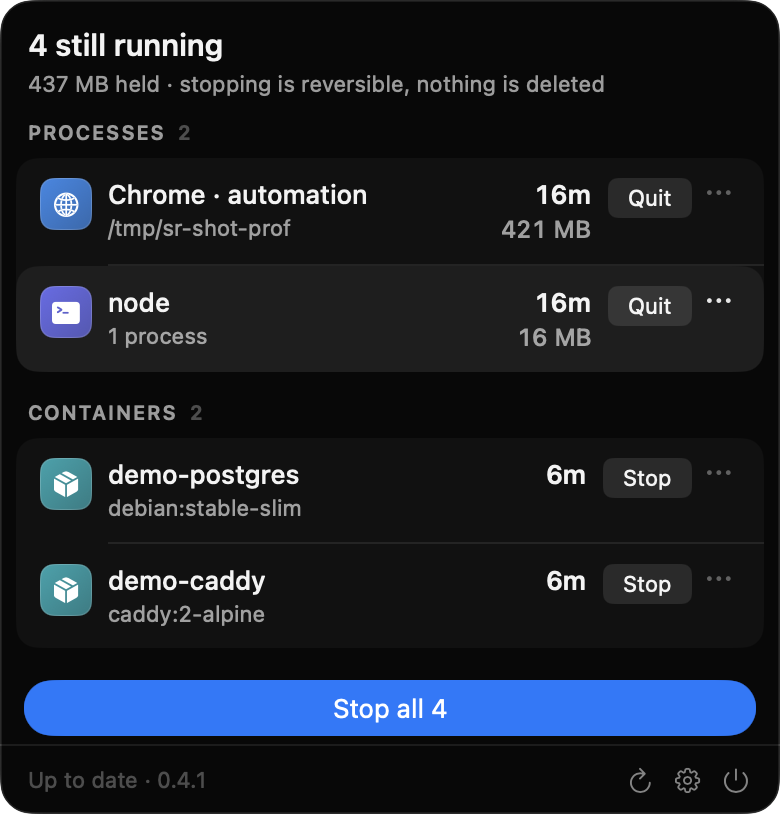
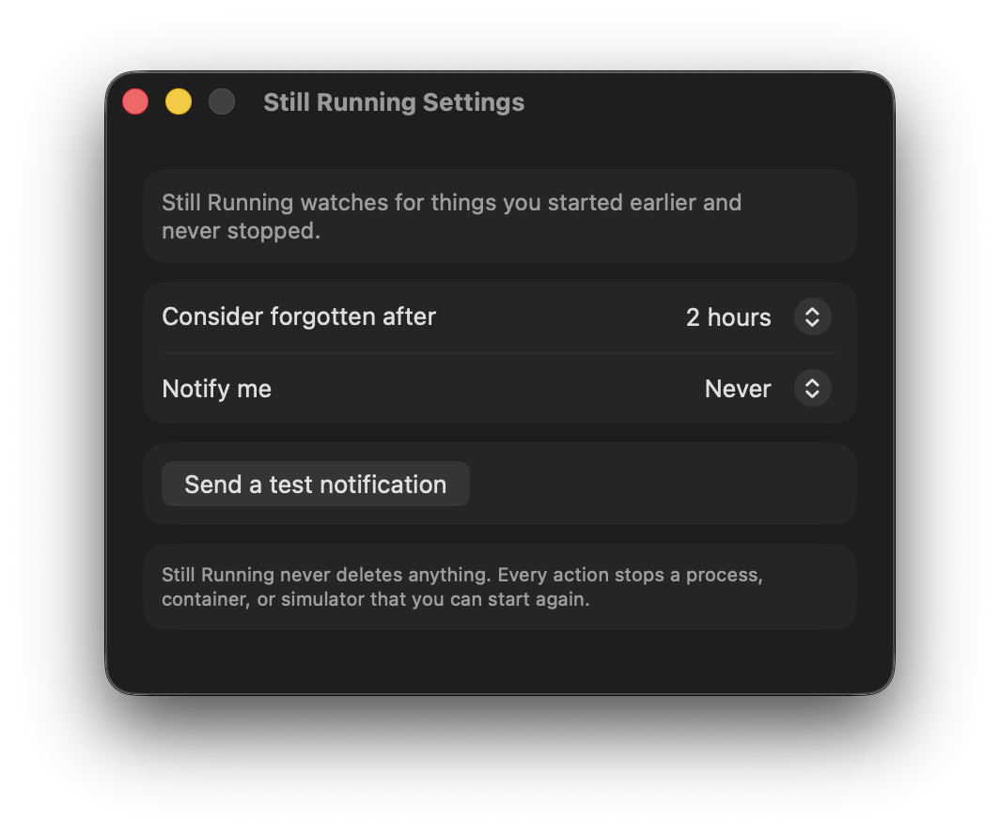

<h1 align="center">Still Running</h1>

<p align="center">
  <strong>The containers, simulators, and stray processes you forgot are still running.</strong><br>
  A small macOS menu bar app that finds them and stops them in one click.
</p>

<p align="center">
  
  
  <a href="LICENSE"></a>
</p>

<p align="center">
  
</p>

<p align="center">
  <sub>Lives in the menu bar. No Dock icon, no window, no account, no login item.</sub>
</p>

<p align="center">
  <sub>The icon stays monochrome, the way menu bar icons do. It carries the
  size of the waste rather than only its count: a quiet ring when nothing is
  left over, a dotted ring once something is, a flame once it is eating a core
  — and the number beside it becomes a percentage when that is the more useful
  figure.</sub>
</p>

## Why

A laptop got hot. The cause turned out to be a headless Chrome, started by a
tool, running for eighteen hours on a throwaway profile, burning most of a core
the whole time. Nothing in Activity Monitor said *you forgot about this one* —
it just showed a browser near the top of a list, next to the browser actually
in use.

Activity Monitor answers **what is using CPU right now**. Still Running answers
**which of these did I forget about, and is it safe to stop**.

## What it finds

| | Signal |
| --- | --- |
| **Automation browsers** | `--user-data-dir` outside the normal profile, `--headless`, or a remote-debugging port |
| **Containers** | Docker, OrbStack, Colima, Podman or Rancher, aged by when the current run started |
| **Simulators** | Booted iOS simulators, and Android emulators named after the device |
| **Dev servers** | node, bun, deno, vite, next, webpack, metro, astro, uvicorn, gradle daemons, watchman |
| **Tunnels** | cloudflared, ngrok and friends, with what they're publishing |
| **Orphans** | Reparented to launchd with no controlling terminal — and not a service launchd manages on purpose |

Every row says what it is if you rest on it, because a profile path or a
container name is an identifier rather than an explanation. The **⋯** menu
takes you to it in Finder where there is somewhere to go, and copies the pids,
paths and commands where there isn't.

Something appears only once it also crosses a threshold: older than two hours,
or orphaned, or above 25% CPU sustained for three minutes, or idle for half an
hour while holding more than 500 MB. All of them are adjustable.

Rates come from a rolling five-minute history rather than a single reading, so
a brief spike never puts anything on the list. The header reports how hard
macOS says the machine is being pushed — the reading it acts on when it spins
the fans — and says nothing at all while the machine is comfortable.

A dev server is usually several processes — `npm run dev` launches a framework,
which launches a bundler — so it is reported and stopped as the tree it is,
named after the project it belongs to. One that has done any real work in the
last ten minutes is left alone: that is a server you are using, not one you
forgot.

A tunnel is listed on age alone. Everything else here wastes a core; a tunnel
you forgot is still publishing a port on your machine to the internet.

**What it deliberately won't offer to stop:** editors and IDEs, and desktop
virtual machines. Both can hold work that has not been written to disk, and an
app whose promise is *this is safe to stop* has no business guessing about
that. They show up under Busy, but yours, with no button.

## What it will never do

- **Never deletes anything.** It stops things.
- **Never touches your browser's own tabs.** Only isolated and automation
  profiles are ever offered. A browser on its normal profile is refused at two
  separate layers, and there is a test that proves it on a live machine.
- **Never force quits on its own.** The first click sends SIGTERM. Force quit
  is a separate, explicitly labelled action that appears only if the first one
  was ignored.
- **Never asks for privileges.** No root, no Accessibility, no Full Disk
  Access, no login item. It reads the process table, which any process may do.

Processes it cannot vouch for appear under **Busy, but yours** — visible, but
with no button next to them.

## Getting it wrong

Every stop has a way back, and each kind gets the most honest one available.

A **container or simulator** stops right away and then offers to start it again
for two minutes. That is a real undo: `docker start` and `simctl boot` bring
back exactly what was there.

A **process** cannot be undone. Re-running an argument vector is not the same
program in the same state, and a signal cannot be recalled. So the way back
comes first instead: the click starts a three second countdown that can be
cancelled before anything is sent.

**Stop all** asks before it acts, and lists what will go.

Anything you always keep running can be dismissed for good from the row's
**⋯** menu. It goes on running; it just stops being mentioned.

## Settings

<p align="center">
  
</p>

Two things to set: how long something must run before it counts as forgotten,
and when to be reminded. Reminders are one quiet notification when something has been running far past
your threshold, at most once per thing. The test button asks macOS for
permission and reports back exactly what it allows, including whether sound is
switched off for the app — which macOS keeps as a separate switch.

## Install

You build it. One command:

```bash
git clone https://github.com/selinihtyr/still-running
cd still-running && ./scripts/install.sh
```

That builds the app, puts it in `/Applications`, and starts it. Look for the
ring in your menu bar — there is no Dock icon and no window.

There is no notarised download, because notarising needs a paid Apple developer
account and this is a free thing I wrote for myself. Building it yourself is
better anyway: Gatekeeper never gets an opinion, and you can read every line
that ends up running on your machine.

Requires macOS 26 and Xcode 26.

To update, `git pull && ./scripts/install.sh`. To uninstall, quit it from the
panel and delete `/Applications/Still Running.app`.

## Working on it

```bash
swift test           # 177 tests, no network, nothing touched
./scripts/bundle.sh  # produces build/Still Running.app without installing it
```

There is a second suite that drives the real machine — it starts a container
and boots a simulator, stops each through the same code the panel uses, and
puts them back. It is off unless asked for, so a plain `swift test` and CI
leave the system alone:

```bash
STILL_RUNNING_LIVE_TESTS=1 swift test
```

## How it works

`ProcessKit` samples the process table through `sysctl` and `libproc` into a
serialisable `Snapshot`. `DockerClient` adds containers by speaking HTTP over
the Docker unix socket. `SimulatorSource` adds simulators through `simctl`.
`Detectors` turns a snapshot plus rolling history into findings, and `Actions`
stops them behind a safety guard that no other code path can bypass.

Because a snapshot is just data, every rule is tested against recorded fixtures
of real machine states — including the one where the user's own Chrome must not
be flagged while an automation Chrome beside it must be.

**It stays out of the way.** A sample costs about 115 ms and runs every five
seconds while the panel is open, once a minute while it is closed. Getting
there took work: reading every process's arguments meant a megabyte-sized
buffer per process, which cost 614 ms per sweep. Arguments cannot change while
a process lives, so they are cached against its start time; container start
times are inspected once; and `simctl`, the most expensive call of all, is only
spawned when a booted device's `launchd_sim` is actually there.

## License

MIT.

## Changelog

[CHANGELOG.md](CHANGELOG.md) — what changed in each version, in the words of
someone using it.
